# SOC146 — Phishing Mail Detected: Excel 4.0 Macros

> Hands-on phishing investigation completed in the LetsDefend SOC environment.

## 1. Overview

This investigation focused on a high-severity phishing alert involving a malicious Excel file containing Excel 4.0 macros.

The investigation started with a phishing email and continued through attachment analysis, sandbox analysis, log investigation, endpoint investigation, and malicious file/domain analysis.

The investigation was ultimately classified as a **True Positive**.

> **Note:** This is a controlled cybersecurity lab investigation completed in LetsDefend. The event details below are preserved from the LetsDefend investigation.

---

## 2. Alert Details

| Field | Value |
|---|---|
| **Event ID** | 93 |
| **Rule** | SOC146 - Phishing Mail Detected - Excel 4.0 Macros |
| **Event Time** | 2021-06-13T14:13:28+03:00 |
| **Severity** | High |
| **Type** | Exchange |
| **Role** | Security Analyst |
| **Difficulty** | Easy |
| **Result** | True Positive |
| **MITRE ATT&CK** | T1566 |
| **Ticket** | SOC146 - Phishing Mail Detected - Excel 4.0 Macros |

### Alert

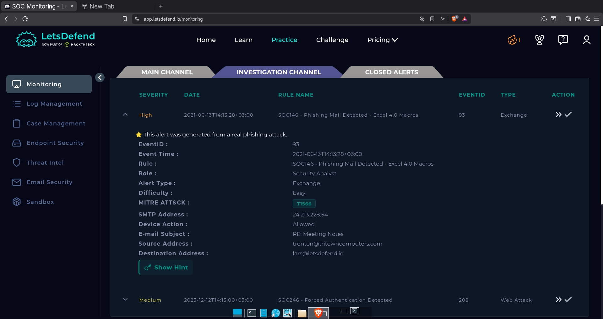

The alert was generated for a suspected phishing email involving an Excel attachment.

---

## 3. Initial Email Analysis

The email information provided during the investigation was:

| Field | Value |
|---|---|
| **Subject** | RE: Meeting Notes |
| **Source Address** | trenton@tritowncomputers.com |
| **Destination Address** | lars@letsdefend.io |
| **SMTP Address** | 24.213.228.54 |
| **Device Action** | Allowed |

### Phishing Email

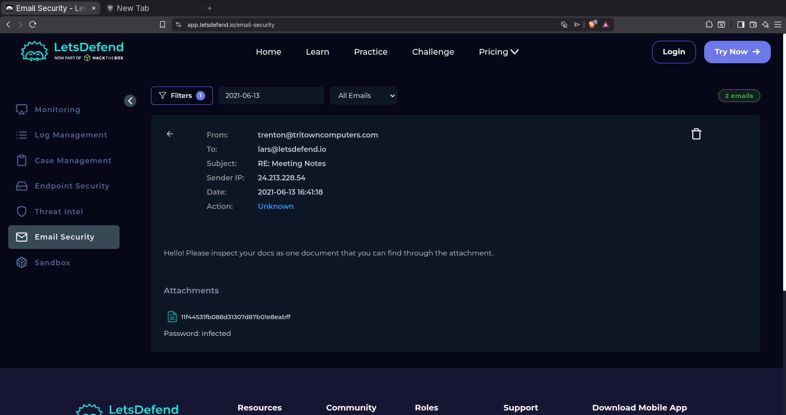

The email contained an attachment, which required further analysis to determine whether it was malicious.

---

## 4. Attachment Analysis

The attachment was identified as an Excel file.

The investigation confirmed that the attachment was malicious.

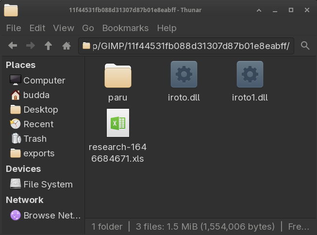

The attachment analysis showed that the file contained suspicious content associated with Excel 4.0 macros.

The investigation therefore continued to determine whether the file had been opened and executed on the destination system.

---

## 5. Sandbox Analysis

The Excel attachment was analyzed in a sandbox environment.

The sandbox analysis showed harmful behavior associated with the file and provided additional indicators for further investigation.

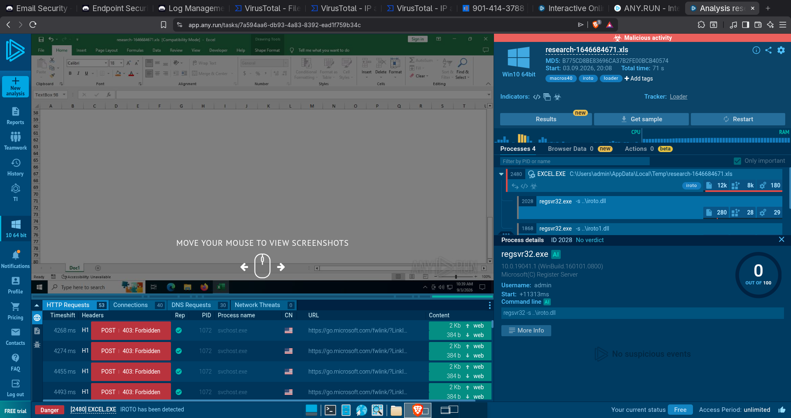

The analysis identified DLL-related activity involving:

- `iroto.dll`
- `iroto1.dll`

Further investigation was performed to understand how these files were introduced and executed.

---

## 6. DLL Analysis

The identified DLL files were investigated as part of the malware analysis.

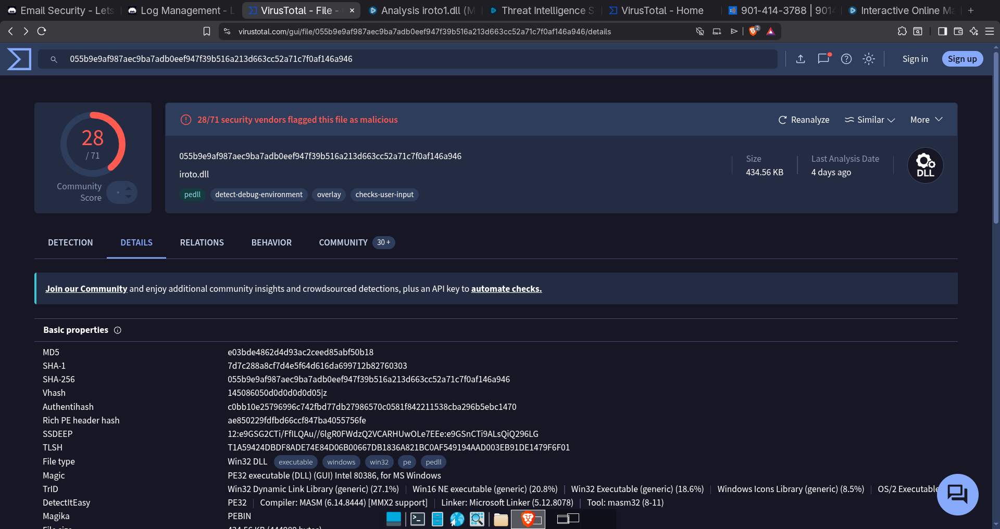

The analysis provided additional evidence that the attachment was malicious and helped identify indicators that could be searched for in the environment.

---

## 7. Endpoint Investigation

The source address identified during the investigation was searched through endpoint management.

The investigation associated the activity with the **LarsPRD** device.

The endpoint was then examined for evidence of execution and network activity.

### Command History

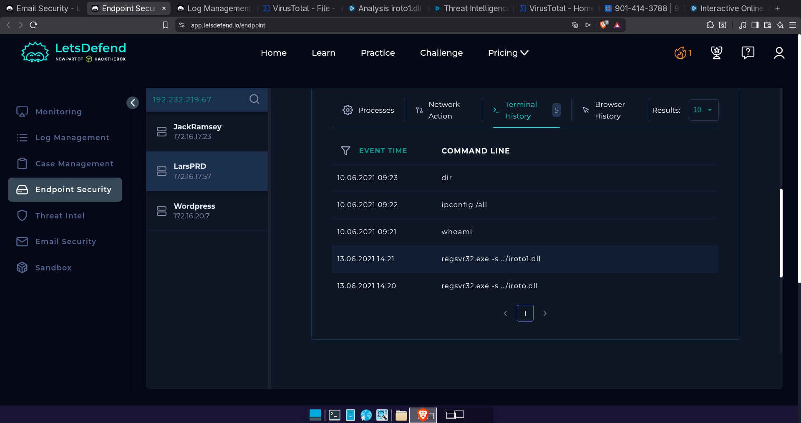

The command history showed execution of the `regsvr32` command.

This was significant because the investigation associated the command with the Excel 4.0 macro activity observed during the analysis.

---

## 8. Log Management Investigation

The indicators obtained during the sandbox analysis were searched through log management.

The investigation found evidence of access to the identified C2 addresses.

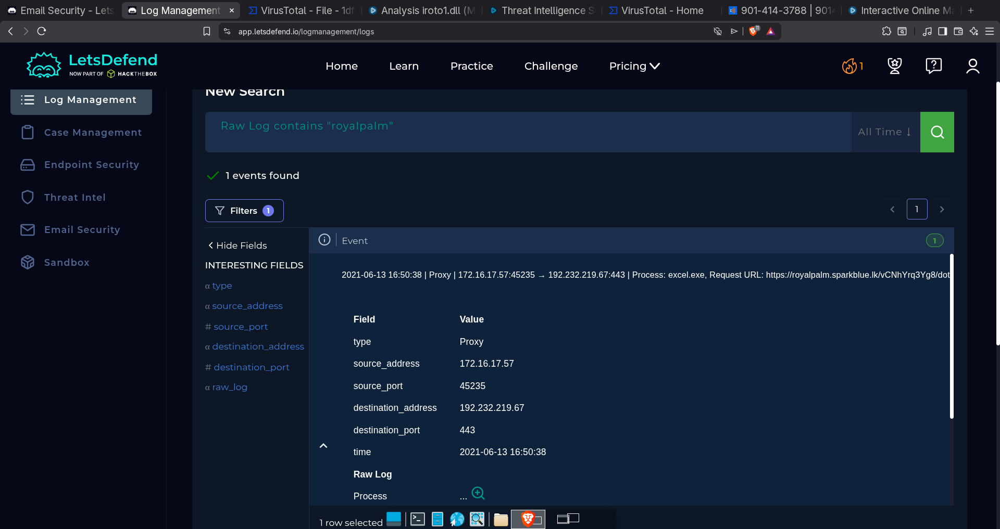

Additional network events were examined to understand communication from the affected system.

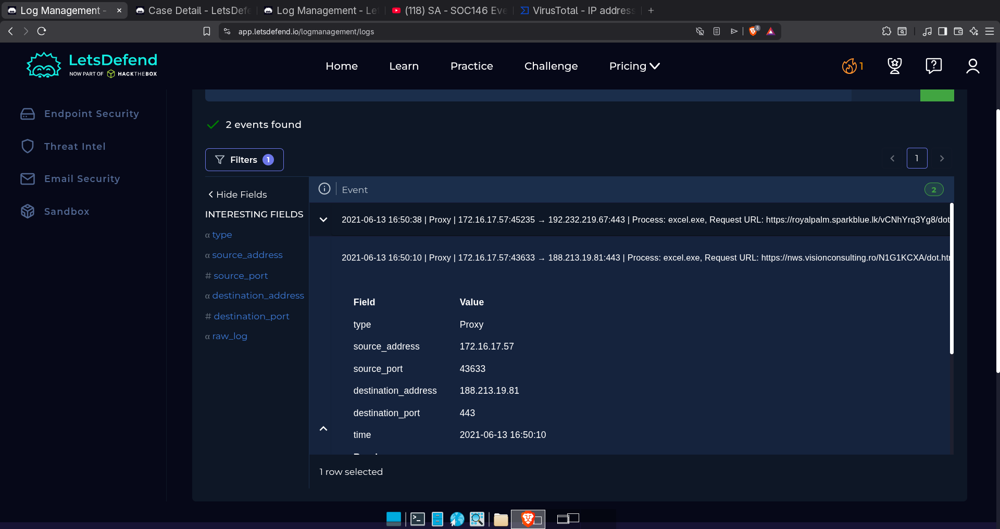

The presence of network activity associated with the identified malicious infrastructure provided additional evidence that the Excel file had been executed.

---

## 9. Malicious Domain Analysis

The identified malicious infrastructure was further investigated.

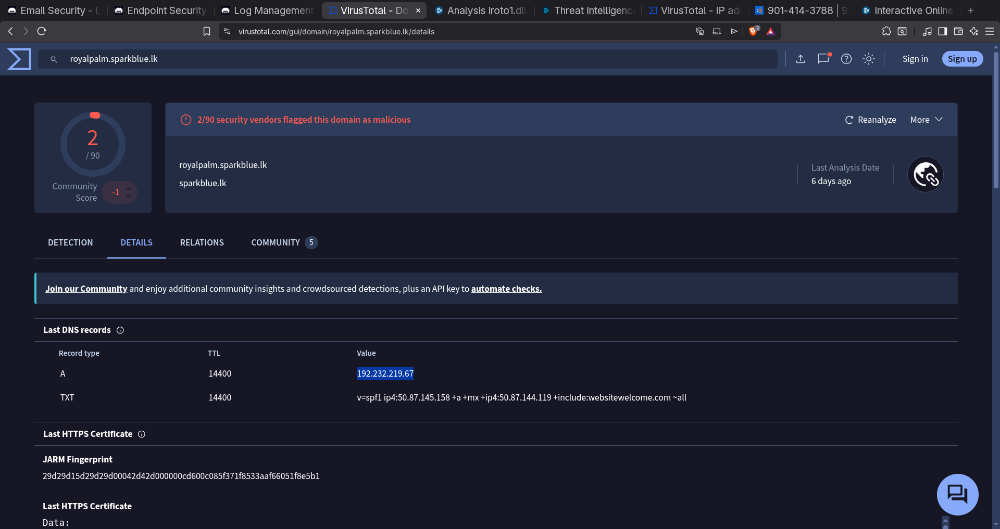

This analysis helped correlate the suspicious network activity with the indicators obtained during the earlier sandbox investigation.

---

## 10. File and Relationship Analysis

Additional relationships between the identified files and activity were examined during the investigation.

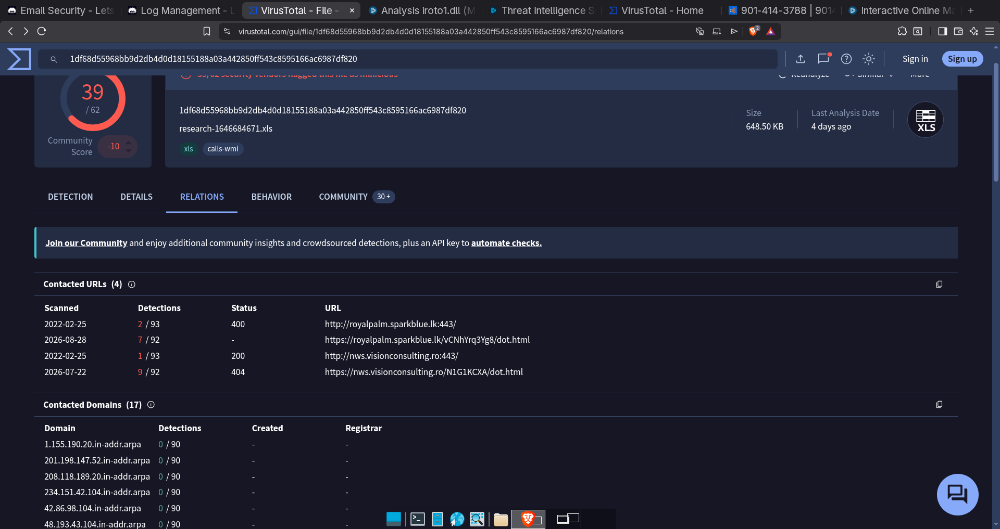

This provided additional context around the malicious Excel file and associated activity.

---

## 11. Excel File Detection

The Excel file was also examined using malware-analysis resources.

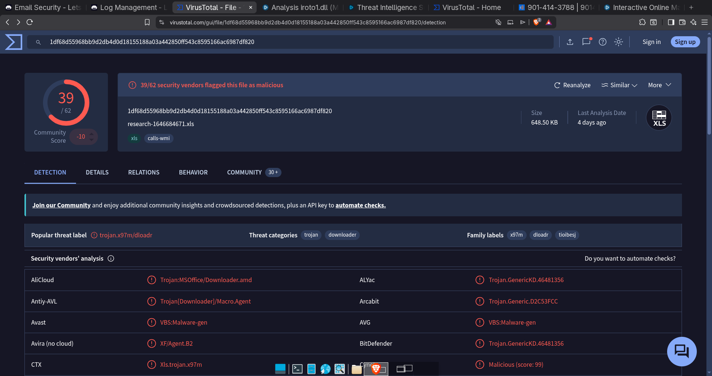

The analysis confirmed that the Excel file was harmful.

---

## 12. Investigation Findings

The investigation established the following:

- A phishing email was delivered to the target user.
- The email contained a malicious Excel attachment.
- The Excel attachment was identified as harmful during analysis.
- Sandbox analysis produced C2 indicators for further investigation.
- Log management showed access associated with the identified C2 addresses.
- The affected endpoint was identified as **LarsPRD**.
- Endpoint investigation showed communication with malicious addresses.
- Command history showed execution of `regsvr32`.
- DLL activity involving `iroto.dll` and `iroto1.dll` was observed.
- The overall investigation was classified as a **True Positive**.

---

## 13. Analyst Assessment

The evidence indicated that the malicious Excel attachment had been executed on the affected system.

The observed DLL activity, `regsvr32` execution, and communication with identified malicious infrastructure indicated that the endpoint should be treated as compromised.

### Analyst Note

> Phishing email was sent from `trenton@tritowncomputers.com` to `lars@letsdefend.io` with a malicious XLS attachment. After the file was opened, `iroto.dll` and `iroto1.dll` were downloaded and loaded via `regsvr32.exe`. The system should therefore be isolated/contained.

---

## 14. Recommended Response

Based on the investigation findings, the affected endpoint should be isolated or contained to prevent further malicious activity.

Recommended investigation and response actions include:

1. Isolate the affected endpoint.
2. Investigate the malicious Excel file and associated DLLs.
3. Review authentication and endpoint activity for additional compromise indicators.
4. Investigate the identified C2 infrastructure.
5. Continue monitoring for related indicators across the environment.
6. Review the phishing email and attachment delivery path.

---

## 15. MITRE ATT&CK Mapping

The LetsDefend investigation mapped the activity to:

**T1566 — Phishing**

The alert involved a phishing email containing a malicious Excel attachment.

---

## 16. Playbook Results

The investigation playbook achieved:

**20 / 20 — 100% success rate**

Key playbook findings included:

| Investigation Question | Result |
|---|---|
| Was the malicious file/URL opened? | Opened |
| Was the email delivered to the user? | Delivered |
| Was the URL/attachment malicious? | Malicious |
| Were there attachments or URLs? | Yes |

---

## 17. Lessons Learned

This investigation helped me practice a complete phishing investigation workflow in a SOC environment.

Key concepts I practiced included:

- Phishing alert triage
- Email analysis
- Malicious attachment analysis
- Excel 4.0 macro investigation
- Sandbox analysis
- DLL analysis
- Endpoint investigation
- Command-history analysis
- Network and log investigation
- C2 indicator investigation
- Malware-analysis concepts
- MITRE ATT&CK mapping
- True Positive classification

The investigation also demonstrated how evidence from different security sources can be correlated to determine whether a phishing alert represents an actual compromise.

---

## 18. Tools and Platforms

- LetsDefend
- Sandbox analysis
- Log Management
- Endpoint Management
- VirusTotal
- MITRE ATT&CK

---

## 19. Conclusion

This investigation demonstrated how a SOC analyst can investigate a phishing alert from initial detection through final classification.

Starting with the phishing email and malicious Excel attachment, I followed the available evidence through sandbox analysis, endpoint investigation, command history, log management, network activity, and malware analysis.

The combined evidence supported the conclusion that the malicious Excel file had been executed and that the affected system should be treated as compromised.

The alert was therefore classified as a **True Positive**.

---

### Investigation Summary

**Alert:** SOC146 - Phishing Mail Detected - Excel 4.0 Macros  
**Severity:** High  
**Result:** True Positive  
**MITRE ATT&CK:** T1566 — Phishing  
**Environment:** LetsDefend SOC Lab  
**Role:** Security Analyst
